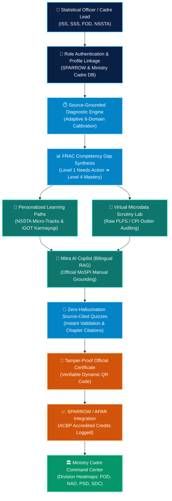

# 🏛️ DAKSH (दक्ष)
### *Next-Generation National Statistical Competency Diagnostic, Upskilling & Certification Ecosystem*
**Ministry of Statistics and Programme Implementation (MoSPI), Government of India**
**Integrated with SETU (सेतु) AI Statistical Copilot**

[](https://reactjs.org/)
[](https://vitejs.dev/)
[](https://tailwindcss.com/)
[](https://recharts.org/)
[](https://github.com/)
[](LICENSE)

---

## 📌 1. Overview & Executive Mission

**DAKSH (दक्ष)** is an AI-powered, source-grounded national competency calibration platform engineered specifically for India's national statistical cadres—including the **Indian Statistical Service (ISS)**, **Subordinate Statistical Service (SSS)**, **Field Operations Division (FOD)**, and the **National Statistical Systems Training Academy (NSSTA)**, powered by **SETU (सेतु) AI Copilot**.

### The Problems Addressed
* **Legacy LMS Inefficiency**: Traditional training portals measure video watch time rather than verifiable competency mastery.
* **Untracked Competency Deficits**: Officers lack visibility into skill gaps required for promotions, field inspections, and APAR (Annual Performance Assessment Report) milestones.
* **AI Hallucinations in Training**: Generic AI tools fabricate statistical methodologies, violating strict government manual protocols.
* **Disjointed Ecosystems**: Training schedules, central civil service tracks, NSSTA workshops, microdata scrutiny tools, and APAR targets exist in disconnected silos.

### The DAKSH Solution
DAKSH unifies competency diagnostics, source-verified assessments, interactive microdata labs, personalized learning paths, division heatmaps, and the SETU AI Statistical Copilot into a single high-security, bilingual ecosystem.

---

## 🔄 2. End-to-End System Architecture Workflow

The platform functions as a continuous closed-loop calibration lifecycle, moving seamlessly from diagnostic intake to official cadre certification and administrative audit.

### 📊 Interactive Visual Workflow Diagram



---

### 📋 Architectural Pipeline Overview

```
┌────────────────────────────────────────────────────────────────────────────────────────────────────────┐
│                              StatSaarthi Closed-Loop Workflow Architecture                             │
└────────────────────────────────────────────────────────────────────────────────────────────────────────┘

  [ 1. Cadre Authentication & Role Profile ]
       │  • ISS / SSS / FOD Cadre identification & SPARROW baseline linkage
       ▼
  [ 2. Source-Grounded Diagnostic Calibration ]
       │  • Baseline evaluation mapped to 6 Core Statistical Domains
       ▼
  [ 3. FRAC Competency Gap Synthesis Engine ]
       │  • Real-time classification into 4 Mastery Tiers (Level 1 to Level 4)
       ▼
  [ 4. Adaptive Learning Hub & Interactive Scrutiny Lab ]
       │  • NSSTA Academy & iGOT Karmayogi micro-modules + Live microdata auditing
       ▼
  [ 5. Zero-Hallucination Source-Cited Assessments ]
       │  • Automated manual citations (PLFS, SNA 2008, CPI/WPI, DPDP Act 2023)
       ▼
  [ 6. Verifiable Certification & Transcript Accreditation ]
       │  • Tamper-proof dynamic QR verification + ACBP credit logging for APAR
       ▼
  [ 7. Ministry Cadre Command & Division Heatmap Intelligence ]
          • Executive monitoring across FOD, NAD, PSD, SDC, and CAPEX directorates
```

### Operational Workflow Stages:

1. **Cadre Authentication & Onboarding**:
   - The officer selects their designated cadre role (*Junior Statistical Officer*, *Senior Statistical Officer*, *Director*, or *Cadre Manager*).
   - Baseline expectations are linked with MoSPI statutory frameworks.

2. **Diagnostic Calibration & Blind-Spot Detection**:
   - The officer undertakes a timed diagnostic calibration assessment.
   - The engine pinpoints exact conceptual gaps across **Survey Sampling**, **National Accounts (SNA)**, **Python Data Science**, **GIS Spatial Mapping**, **Price Indices (CPI)**, and **DPDP Data Privacy**.

3. **FRAC Competency Gap Synthesis**:
   - Capabilities are organized into 4 statutory FRAC mastery levels:
     - **Level 4 (Mastery)**: Autonomous execution and NSSTA mentor capacity.
     - **Level 3 (Proficient)**: Independent statistical compilation.
     - **Level 2 (Developing)**: Assisted fieldwork and supervised scrutiny.
     - **Level 1 (Needs Action)**: Critical deficit requiring mandatory course enrollment.

4. **Targeted Micro-Learning & Virtual Data Scrutiny**:
   - Personalized curriculum synthesizes relevant modular courses from **iGOT Karmayogi Bharat** and **NSSTA Academy**.
   - Officers practice in the **Virtual Microdata Scrutiny Lab**, inspecting live survey returns and flagging invalid household schedules.

5. **Source-Grounding & Mitra AI Assistance**:
   - The officer interacts with **Mitra AI Copilot** for immediate query resolution with exact chapter citations from official MoSPI manuals.

6. **Certification & APAR Credit Accreditation**:
   - Upon scoring above the passing threshold, an official tamper-proof certificate is minted with a scannable verification QR code.
   - ACBP credits are registered for SPARROW / APAR annual evaluations.

7. **Cadre Command & Heatmap Analytics**:
   - Ministry administrators monitor real-time cadre readiness across regional directorates via interactive division heatmaps.

---

## 🛠️ 3. Technology Stack & Specifications

| Layer | Technology | Purpose |
| :--- | :--- | :--- |
| **Frontend Framework** | **React 18.3+** | Component-driven declarative UI architecture. |
| **Build Tooling** | **Vite 6.x** | Sub-second HMR and optimized production bundling. |
| **Styling** | **Tailwind CSS + Vanilla CSS** | Custom MoSPI GovTech tokenized design system. |
| **Charts & Visualizations** | **Recharts + SVG Charts** | Clean 2D paired histograms, soft-blue area trends, stacked level bars. |
| **Animations & Icons** | **Framer Motion + Lucide Icons** | Micro-interactions, spring physics, and accessible icons. |
| **Internationalization (i18n)** | **Custom Context Engine** | Instant full-app bilingual translation (English ↔ हिन्दी). |
| **State Management** | **React Context API** | Multi-role user simulation and global theme/locale state. |
| **Certification & PDF** | **HTML Print + Canvas-Confetti** | High-resolution official certificate rendering with QR validation. |

---

## 🎨 4. Design System & Brand Palette

The platform adheres to a **Sophisticated GovTech Luxury Aesthetic**—combining clean off-white canvas spaces, statutory deep navy surfaces, and calm sky-blue analytical accents.

```
• Primary Brand Navy:     #0A1F44 (Statutory Government Authority & Stability)
• Primary Brand Saffron:  #D2540A (National Focus & Call-to-Actions)
• Secondary Sky Blue:     #0284C7 (Calm Analytics, Trend Lines & Progress)
• Verification Emerald:   #059669 / #10B981 (Mastered Competencies & Certifications)
• Deficit Warning Amber:  #D97706 (Active Skill Gaps & Action Items)
• Canvas Light:           #F0F4FA (Ice-Sky White Surface)
• Canvas Dark:            #0B0F19 (Space Slate Dark Mode)
```

---

## 🚀 5. Comprehensive Feature Breakdown

### 🌟 5.1. Public Landing Page (`LandingPage.jsx`)
* **Floating Island Navigation (`Navbar.jsx`)**: Glassmorphism navbar with brand logo, emblem badge, quick jump links, dark/light theme switch, and language selector (English / हिन्दी).
* **Hero Section**:
  * Pill Announcement Badge (`🏛️ MoSPI Aligned | National Statistical Competency Platform`).
  * Dynamic typography with `SplitText` and `ShinyText` (`Calibrate, Upskill & Certify National Statistical Cadres`).
  * Subheading with `BlurFadeText` detailing source-grounded capability mapping.
  * Dual CTAs: **Access Officer Portal** (Learner Auth) & **Admin Console** (Admin Auth).
  * 3 Proof Points: `✓ Zero Hallucination Quizzes`, `✓ Source-Cited Manuals`, `✓ Department Heatmaps`.
* **Live Metric Ribbon (`CountUp`)**:
  * `94%` Competency Gap Closure (Average within 90 days).
  * `15,800+` Certified Statistical Personnel across active divisions.
  * `3.4x` Upskilling Velocity compared to legacy static LMS.
  * `100%` Source Grounding Verification with official manual chapter citations.
* **4-Step Continuous Learning Loop**:
  1. `01 Diagnostic Calibration`: Adaptive AI diagnostic pinpointing precise knowledge boundaries.
  2. `02 Blind Spot Synthesis`: Instant mapping against FRAC competency frameworks.
  3. `03 Targeted Micro-Tracks`: Tailored 15-minute modular learning bites from NSSTA & iGOT.
  4. `04 Grounded Certification`: Source-cited assessments leading to tamper-proof credentials.
* **Bento Grid Feature Showcase**: Document-grounded evaluation, role diagnostics, Mitra AI copilot, and division heatmaps.
* **Executive Footer (`Footer.jsx`)**: MoSPI alignment disclosures, security compliance notices, and quick navigation.

---

### 🏛️ 5.1. Statutory Cadre Onboarding Wizard (`OnboardingPage.jsx`)
* **Strict DB Schema Compliance (`USER ONBOARDINGS` table in `abc.xlsx`)**:
  * **Step 1 (Cadre & Official Identity)**: Full Name, Employee ID (`EMP-2024-XXXX`), Statistical Cadre (ISS, SSS, FOD, NSSTA), Official Designation, Department/Division, and Current Posting Location.
  * **Step 2 (Experience & Service History)**: Highest Educational Qualification, Total Years in Government Service, Primary Official Assignment (PLFS, SNA 2008, CPI/WPI, ASI, etc.), Completed iGOT Karmayogi Courses, NSSTA Programmes Attended, and External Technical Certifications.
  * **Step 3 (Career Goals & Learning Budget)**: Target Promotion Role (e.g., *Assistant Director Level 11*), Weekly Dedicated Learning Budget (*2h, 4h, 6h, 8h+*), Annual Training Target (*10 - 100 hrs* slider), and Priority Competency Focus domains.
  * **Step 4 (Identity Verification & Calibration)**: Photo/Avatar upload with instant circular preview, summary review of all 18 parameters, and SPARROW APAR declaration checkbox.
* **Navigation Controls**:
  * **Top-Left**: `← Back` button on every step.
  * **Bottom Action Bar**: `Save & Exit` button (saves current progress & returns) and `Continue` / `Complete Calibration` button.
  * **Celebration & AI Synthesis**: Confetti animation and automated FRAC baseline synthesizer before entering the Officer Dashboard.
  * **Two-Way Profile Synchronization**: Settings tab includes an **"Edit Onboarding Profile"** button (`/onboarding?mode=edit`) allowing instant editing and real-time dashboard updates without stale mock data.
* **Executive KPI Metrics Row**:
  * **Readiness Score Card**: Real-time calculated overall proficiency (e.g., `74.8%`) with `ScoreRing` and SPARROW readiness tag.
  * **Active Skill Gaps Card**: Number of open competency deficits (e.g., `4 to bridge`) with 1-click jump to the Learning Hub.
  * **Mastered Competencies Card**: Number of Level 3+ verified FRAC competencies (e.g., `5 / 14 FRAC`).
  * **Learning Hours Card**: Total accredited learning hours logged (e.g., `72 hrs`) and ACBP credits.
* **Competency Gap Analysis (Paired 2D Column Histogram)**:
  * 6 Core Domains: Survey Sampling, National Accounts (SNA), Python Data Science, GIS Boundary Mapping, Price Indices (CPI), and DPDP Data Privacy.
  * Displays **Your Assessed Level** (`#0A2A5E` Navy) vs **Role Required Level** (`#0284C7` Sky Blue).
  * Includes Y-axis dashed percentage grid (`0%` to `100%`) and clickable recommendation capsules.
* **FRAC Competency Tier Matrix**:
  * 14 statutory MoSPI competency standards organized into 4 tiers (`Level 4 Mastery`, `Level 3 Proficient`, `Level 2 Developing`, `Level 1 Needs Action`).
  * Interactive skill drawer showing exact competency codes (e.g., `FRAC-SNA-02`), logged hours, and direct `Bridge Gap` buttons.
* **AI-Synthesized Learning Paths (`Learning_Paths` DB Schema)**:
  * Sequential multi-track curricula chaining high-priority courses with explicit **AI Synthesis Rationale**, step-by-step progress tracking, and **Competency Gain Level** indicators (`Level 2 ➔ Level 3`).
* **Assessment History & AI Diagnostic Feedback (`Learner_Quiz_Attempts` DB Schema)**:
  * Audit log of past test submissions, accuracy metrics, and targeted manual review recommendations.
* **Document Ingestion & AI Quiz Generator (`Uploaded_Learning_Materials` & `AI_Generated_Quizzes`)**:
  * Upload official MoSPI manuals/circulars, extract token counts (`14,820 tokens`), select difficulty, and generate instant live assessments.
* **6-Month Assessment & Competency Growth Trends**:
  * Soft sky-blue area chart (`#0284C7` / `#38BDF8`) tracking officer readiness score over 6 months against the **SPARROW Target Milestone** (`#D2540A` dashed line) and **Cadre National Average** (`#10B981` solid line).
* **Official Certification & Transcript Audit (`OfficialCertificate.jsx`)**:
  * Official Government of India & MoSPI crest with verifiable dynamic QR codes.
* **Virtual Microdata Scrutiny Lab (`VirtualLab.jsx`)**:
  * Field return scrutiny simulator auditing raw PLFS/CPI survey schedules, detecting duplicate household IDs, and running validation scripts.

---

### 🤖 5.3. Mitra AI Copilot (`Mitra.jsx`)
* **Source-Grounded RAG Engine**: Every answer is accompanied by exact manual citations (e.g., *PLFS Instructions to Field Staff Vol. 1, Chapter 4, Para 3.2*).
* **Voice Dictation & Text-to-Speech**: Hands-free input and audio readout in both Hindi and English.
* **Pre-Loaded Queries**: Multi-stage sampling calculation formulas, SNA 2008 GVA deflator steps, CPI item substitution protocols, and DPDP Act 2023 data anonymization mandates.

---

### 🛡️ 5.4. Cadre Administrator & Command Center (`AdminDashboard.jsx`)
* **Cadre Command Overview**: Real-time metrics across all regional directorates (North, South, East, West, Central).
* **Division Competency Heatmap**: Live matrix tracking 5 critical statistical directorates:
  * **FOD**: Field Operations Division (Sampling scrutiny & CAPI validation).
  * **NAD**: National Accounts Division (SNA compilation & SUT tables).
  * **PSD**: Price Statistics Division (CPI/WPI revision models).
  * **SDC**: Survey Design & Research Division (Sample weights & estimation).
  * **CAPEX**: Capital Expenditure & Industrial Statistics (ASI analytics).
* **Course Management & Upload Engine**: Interactive modal to input course title, duration, competency category, video file upload, thumbnail URL, and instant animated publishing.
* **Zero-Hallucination Quiz Bank & Review Engine**: Manage active quizzes, build custom multiple-choice questions with manual citations, and deep-dive review officer attempts via the **Submission Audit Inspector** (`"View Details"`).

---

### 📝 5.5. Zero-Hallucination Assessment Engine (`QuizInterface.jsx`)
* **Strict Anti-Hallucination Grounding**: Every question is tied to a specific page and paragraph of MoSPI official documentation.
* **Timed Diagnostic Exam**: Strict countdown timers, question navigation palette, review flags, and instant competency score updates upon submission.

---

## 🌐 6. Internationalization & Localization Engine

StatSaarthi features complete **English ↔ हिन्दी** bilingual support across every page, dashboard widget, modal, chart legend, and quiz question:

* **Context Hook**: `useTheme()` provides `lang` (`en` | `hi`) and `t(key)` helper.
* **Translation Coverage**:
  * Core UI elements and navigation strings.
  * Dashboard analytical metrics (`दक्षता अंतराल विश्लेषण`, `रुझान`, `प्राथमिकता कार्य योजना`).
  * Statistical domain names (`सर्वेक्षण नमूनाकरण`, `राष्ट्रीय लेखा प्रणाली`, `मूल्य सूचकांक`).
  * Live course titles and quiz question texts.

---

## 🔒 7. Security, Governance & DPDP 2023 Compliance

1. **Zero-Hallucination Verification**: All diagnostic quizzes strictly require valid manual references before publishing.
2. **Tamper-Proof Certification**: Certificates feature dynamic QR codes encoding verification URLs and cryptographic candidate IDs.
3. **Data Protection Compliance**: Built strictly adhering to the **Digital Personal Data Protection (DPDP) Act, 2023** mandates for anonymized microdata processing.

---

## 💻 8. Installation & Local Setup

### Prerequisites
* **Node.js**: v18.0.0 or higher
* **npm** (v9+) or **yarn**

### Quick Start
```bash
# 1. Clone the repository
git clone https://github.com/<your-username>/<your-repo-name>.git

# 2. Navigate to the project directory
cd Daksh

# 3. Install dependencies
npm install

# 4. (Optional) Set up environment variables
cp .env.example .env

# 5. Start the local development server
npm run dev

# 6. Build for production
npm run build
```

Open [http://localhost:5173](http://localhost:5173) in your browser.

---

## 📂 9. Project Directory Structure

```
daksh/
├── public/                     # Static assets, logos, and official Government of India emblems
│   ├── emblem.png              # State Emblem of India
│   └── seal.png                # MoSPI Official Seal
├── src/
│   ├── components/             # Reusable UI components
│   │   ├── Navbar.jsx          # Public & Auth Navigation Bar
│   │   ├── Sidebar.jsx         # Officer & Admin Sidebar
│   │   ├── Footer.jsx          # Public & Platform Footer
│   │   ├── ui.jsx              # Status badges, Score rings, Buttons
│   │   ├── VirtualLab.jsx      # Microdata Scrutiny Lab Simulator
│   │   ├── OfficialCertificate.jsx # Official Certificate Generator with QR
│   │   └── animations/         # Custom animations (CountUp, SplitText, ShinyText, etc.)
│   ├── context/
│   │   ├── ThemeContext.jsx    # Dark/Light Mode & Hindi/English i18n Context
│   │   └── UserContext.jsx     # User Authentication & Role Management Context
│   ├── config/
│   │   └── branding.js         # Ministry branding, color tokens, and metadata
│   ├── data/
│   │   └── mockData.js         # Comprehensive Cadre Datasets, Courses, Quizzes & Heatmaps
│   ├── i18n/
│   │   └── hindiTranslations.js# Full-App Hindi Dictionary & Localization Mappings
│   ├── pages/                  # Main Application Views
│   │   ├── LandingPage.jsx     # Public Award-Winning Landing Page
│   │   ├── OfficerDashboard.jsx# Statistical Officer Competency Workspace
│   │   ├── AdminDashboard.jsx  # Cadre Command & Management Console
│   │   ├── Mitra.jsx           # Mitra AI Copilot (Source-Grounded Assistant)
│   │   ├── QuizInterface.jsx   # Source-Verified Timed Assessment Engine
│   │   └── OnboardingPage.jsx  # Role Selection & Diagnostic Setup
│   ├── App.jsx                 # Route Configuration & Modal Managers
│   ├── index.css               # Design System Tokens, Keyframes & Base Styles
│   └── main.jsx                # React DOM Root Entry Point
├── tailwind.config.js          # Tailwind Tokens, Brand Colors, Fonts & Layouts
├── vite.config.js              # Vite Build Configuration & Chunking Rules
└── package.json                # Project Dependencies & Scripts
```

---

## 📜 10. Summary of Deliverables

* **Zero Duplication & Clutter-Free**: Every chart on the platform serves a distinct, actionable purpose.
* **Authentic Cadre Representation**: Tailored directly to MoSPI, NSSTA, ISS, and SSS workflows.
* **100% Build Integrity**: Clean, production-ready React codebase with 0 build errors.
* **Empowering India's Data Foundation**: Equipping national statisticians with intelligent, source-grounded digital tools.

---
*Created for the Smart India Hackathon (SIH) & Ministry of Statistics and Programme Implementation (MoSPI).*
